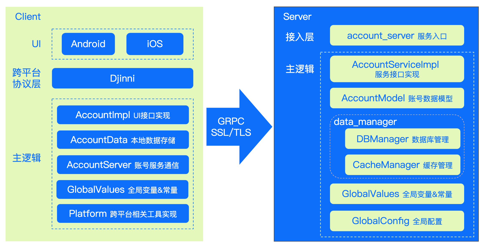
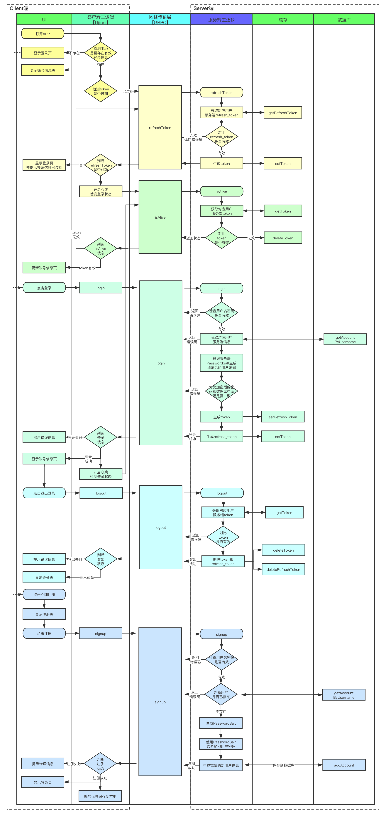
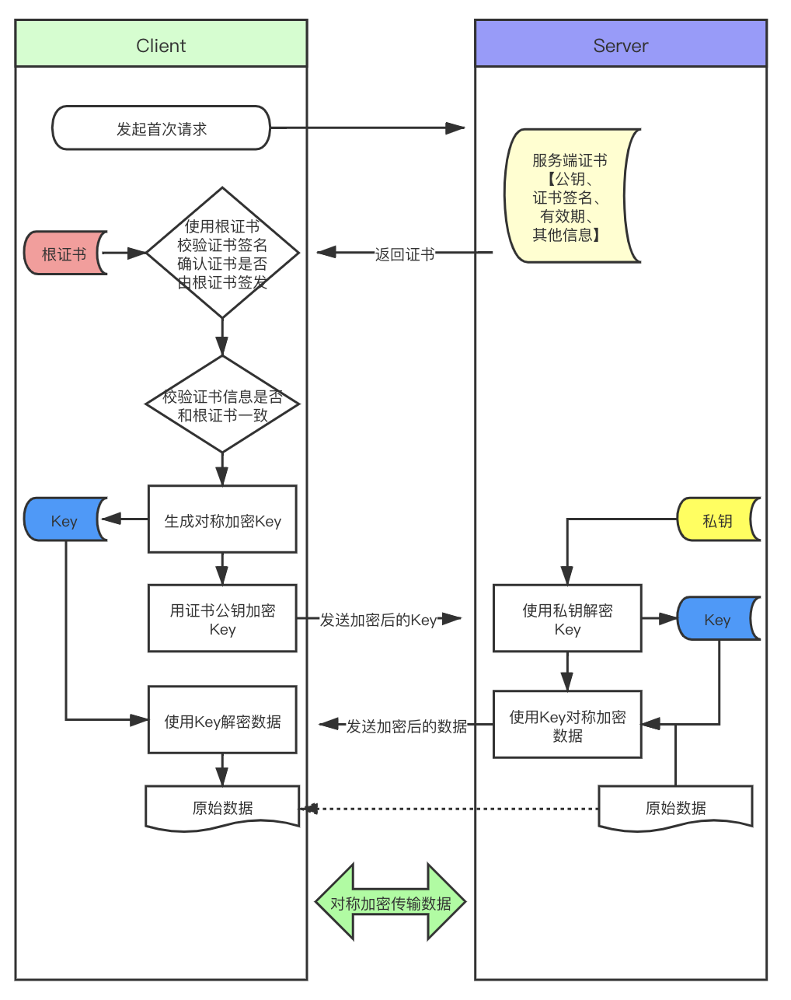
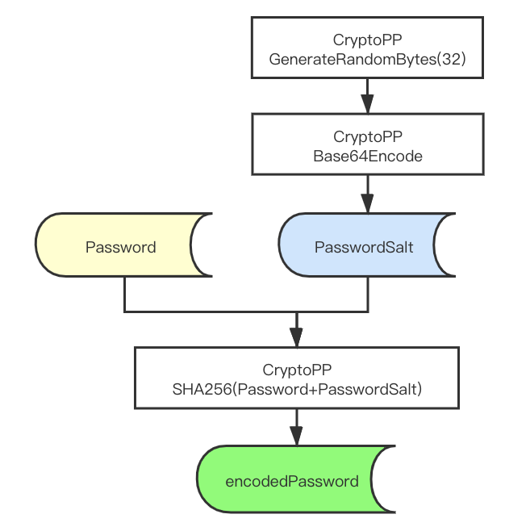
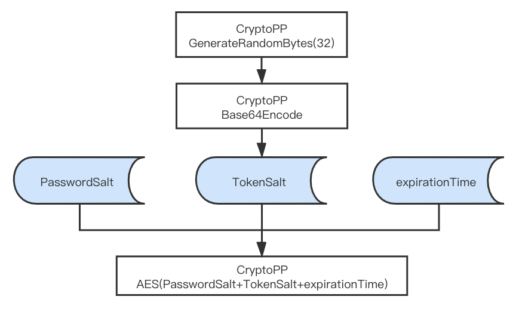
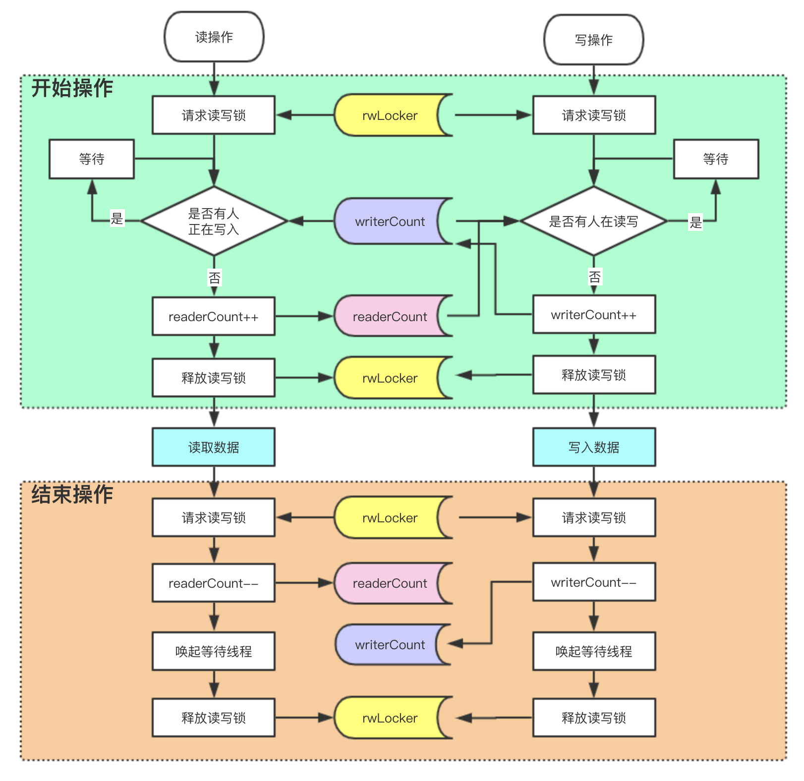

# VChat登录模块简介

----------
## 目录

* [功能描述](#功能描述)
* [技术介绍](#技术介绍)
* [使用说明](#使用说明)

----------
## 功能描述
##### 一套单终端登录系统，具备以下功能
1. 具备注册登录功能
2. 一个用户只能在⼀个设备上登录，切换终端登录时，其他已登录的终端会被踢出
##### 请实现该系统的客户端及后台，要求:
1. 客户端登录模块需要采用C++实现iOS和android的跨平台
2. 终端app只要提供iOS或android一种客户端即可
3. 后台采用grpc实现，使用C++实现，用户信息存储上可以采用sql或nosql实现，设计时需要考虑敏敏感数
据的安全性及传输安全性
4. 后台项目使用bazel编译及管理理项目依赖
5. 项目设计实现周期两周左右，交付物包括可运⾏行行的客户端及后台项目代码，设计文档，使用github管理理
相关资源
6. 使用docker部署，docker compose管理理项目
##### 参考资料料
1. C++实现iOS和android跨平台 https://github.com/dropbox/djinni 
2. grpc https://grpc.io/
3. bazel https://bazel.build/
4. docker compose https://docs.docker.com/compose/
5. docker file https://docs.docker.com/engine/reference/builder/

----------
## 技术介绍
### 技术架构

### 调用流程图

### GRPC SSL/TLS加密传输

### 数据库密码加盐哈希

### Token生成规则

### 多线程数据读写安全

----------
## 使用说明